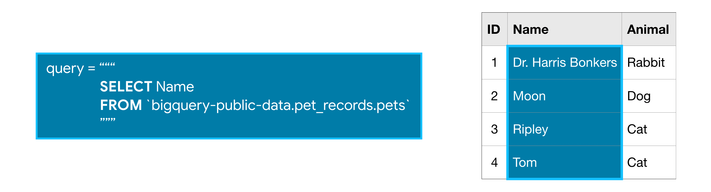

# **Introduction SQL and BigQuery**

**Table des matieres**

1. [GettingStarted](#GettingStarted)
2. [SelectFromWhere](#SelectFromWhere)
3. [GroupByHaving&Count](#GroupByHaving&Count)
4. [OrderBy](#OrderBy)
5. [AS&WITH](#AS&WITH)
6. [JoiningData](#JoiningData)
7. [Recap](#Recap)
<div id='GettingStarted'>

## I) **Getting Started with SQL and BigQuery**

### 1) **Your first BigQuery commands**

```
from google.cloud import bigquery

# Create a "Client" object
client = bigquery.Client()
```


```
# Construct a reference to the "hacker_news" dataset
dataset_ref = client.dataset("hacker_news", project="bigquery-public-data")

# API request - fetch the dataset
dataset = client.get_dataset(dataset_ref)
```
- Create client
- Constructing a reference to the dataset with the ***dataset()*** method.
- ***get_dataset()*** method, along with the reference we just constructed, to fetch the dataset.

Every dataset is just a collection of tables. You can think of a dataset as a spreadsheet file containing multiple tables, all composed of rows and columns.

We use the ***list_tables()*** method to list the tables in the dataset.

```
# List all the tables in the "hacker_news" dataset
tables = list(client.list_tables(dataset))

# Print names of all tables in the dataset (there are four!)
for table in tables:  
    print(table.table_id)
```

We can ***fetch a table***. In the code cell below, we fetch the full table in the hacker_news dataset.

```
# Construct a reference to the "full" table
table_ref = dataset_ref.table("full")

# API request - fetch the table
table = client.get_table(table_ref)
```


### 2) **Table schema**

```
# Print information on all the columns in the "full" table in the "hacker_news" dataset
table.schema
```

Each SchemaField tells us about a specific column (which we also refer to as a field). In order, the information is:

- The ***name*** of the column
- The ***field type*** (or datatype) in the column
- The ***mode*** of the column ('NULLABLE' means that a column allows NULL values, and is the default)
- A ***description of the data*** in that column

We can use the ***list_rows()*** method to check just the first five lines of of the full table

```
# Preview the first five lines of the "full" table
client.list_rows(table, max_results=5).to_dataframe()
```

The list_rows() method will also let us look at just the information in a specific column. If we want to see the first five entries in the by column, for example, we can do that

```
# Preview the first five entries in the "by" column of the "full" table
client.list_rows(table, selected_fields=table.schema[:1], max_results=5).to_dataframe()
```
<div id='SelectFromWhere'>

## II) **Select, From & Where**


### 1) **SELECT ... FROM**

- Specify the column you want after the word SELECT, and then
- Specify the table after the word FROM



### 2) **WHERE ...**

BigQuery datasets are large, so you'll usually want to return only the rows meeting specific conditions. You can do this using the WHERE clause.


example :

```
# Query to select all the items from the "city" column where the "country" column is 'US'
query = """
        SELECT city
        FROM `bigquery-public-data.openaq.global_air_quality`
        WHERE country = 'US'
        """
```

### 3) **Submitting the query to the dataset**

```
# Create a "Client" object
client = bigquery.Client()
```
We begin by setting up the query with the query() method. 
```
# Set up the query
query_job = client.query(query)

# API request - run the query, and return a pandas DataFrame
us_cities = query_job.to_dataframe()

# What five cities have the most measurements?
us_cities.city.value_counts().head()
```

### 4) **More queries**

If you want ***multiple columns***, you can select them with a comma between the names:
```
query = """
        SELECT city, country
        FROM `bigquery-public-data.openaq.global_air_quality`
        WHERE country = 'US'
        """
```

You can select all columns with a *

### 5) **Working with big datasets**

To see ***how much data*** a query will scan, we create a ***QueryJobConfig*** object and set the dry_run parameter to True.

```
# Query to get the score column from every row where the type column has value "job"
query = """
        SELECT score, title
        FROM `bigquery-public-data.hacker_news.full`
        WHERE type = "job" 
        """

# Create a QueryJobConfig object to estimate size of query without running it
dry_run_config = bigquery.QueryJobConfig(dry_run=True)

# API request - dry run query to estimate costs
dry_run_query_job = client.query(query, job_config=dry_run_config)

print("This query will process {} bytes.".format(dry_run_query_job.total_bytes_processed))
```

Limit how much data you are willing to scan.
```
# Only run the query if it's less than 1 MB
ONE_MB = 1000*1000
safe_config = bigquery.QueryJobConfig(maximum_bytes_billed=ONE_MB)

# Set up the query (will only run if it's less than 1 MB)
safe_query_job = client.query(query, job_config=safe_config)

# API request - try to run the query, and return a pandas DataFrame
safe_query_job.to_dataframe()
```

<div id='GroupByHaving&Count'>

## III) **Group By, Having & Count**

### 1) **COUNT()**
--> returns a count of things
if we SELECT the COUNT() of the ID column in the pets table, it will return 4, because there are 4 ID's in the table.


### 2) **GROUP BY**

GROUP BY takes the name of one or more columns, and treats all rows with the same value in that column as a single group when you apply aggregate functions like COUNT().


### 3) **GROUP BY ... HAVING**

HAVING is used in combination with GROUP BY to ignore groups that don't meet certain criteria.


#### **SUMMARY : USE QUERY**

```
# Query to select comments that received more than 10 replies
query_popular = """
                SELECT parent, COUNT(id)
                FROM `bigquery-public-data.hacker_news.comments`
                GROUP BY parent
                HAVING COUNT(id) > 10
                """
```
```
# Set up the query (cancel the query if it would use too much of 
# your quota, with the limit set to 10 GB)
safe_config = bigquery.QueryJobConfig(maximum_bytes_billed=10**10)
query_job = client.query(query_popular, job_config=safe_config)

# API request - run the query, and convert the results to a pandas DataFrame
popular_comments = query_job.to_dataframe()

# Print the first five rows of the DataFrame
popular_comments.head()
```

<div id='OrderBy'>

## IV) **Order By**

### 1) **ORDER BY**

ORDER BY is usually the last clause in your query, and it sorts the results returned by the rest of your query.


- We can also sort the results in reverse order : ***DESC***

### 2) **Dates**

The DATE format has the year first, then the month, and then the day. It looks like this:
```
YYYY-[M]M-[D]D
```
- YYYY: Four-digit year
- [M]M: One or two digit month
- [D]D: One or two digit day

### 3) **EXTRACT**

Often you'll want to look at part of a date, like the year or the day. You can do this with EXTRACT


- Instead of DAY you can use WEEK, MONTH, YEAR, DAYOFWEEK ...

<div id='AS&WITH'>

## V) **AS & WITH**

### 1) **AS**

You learned in an earlier tutorial how to use AS to rename the columns generated by your queries, which is also known as aliasing

### 2) **WITH ... AS**


It's important to note that CTEs only exist inside the query where you create them, and you can't reference them in later queries. So, any query that uses a CTE is always broken into two parts: (1) first, we create the CTE, and then (2) we write a query that uses the CTE.

#### DATE()

In SQL, the DATE() function is used to extract the date part from a datetime expression. It's often used when you have a datetime column and you want to extract only the date portion, discarding the time component.

```
DATE(datetime_expression)
```

<div id='JoiningData'>

## VI) Joining Data

We can join two tables using a common column between them.


- Here we join the table with the column ID in pets table, and the table with the column Pet_ID in owners table.

### LIKE


<div id='Recap'>

### VII) RECAP

```
from google.cloud import bigquery

# Create a "Client" object
client = bigquery.Client()

# Construct a reference to the "stackoverflow" dataset
dataset_ref = client.dataset("stackoverflow", project="bigquery-public-data")

# API request - fetch the dataset
dataset = client.get_dataset(dataset_ref)

# Get a list of available tables 
tables = list(client.list_tables(dataset))
list_of_tables =  [table.table_id for table in tables]

# Print your answer
print(list_of_tables)

# Construct a reference to the "posts_answers" table
answers_table_ref = dataset_ref.table("posts_answers")

# API request - fetch the table
answers_table = client.get_table(answers_table_ref)

# Preview the first five lines of the "posts_answers" table
client.list_rows(answers_table, max_results=5).to_dataframe()

# Construct a reference to the "posts_questions" table
questions_table_ref = dataset_ref.table("posts_questions")

# API request - fetch the table
questions_table = client.get_table(questions_table_ref)

# Preview the first five lines of the "posts_questions" table
client.list_rows(questions_table, max_results=5).to_dataframe()
```
```
# Create your query
questions_query = """
                  SELECT id, title, owner_user_id
                  FROM `bigquery-public-data.stackoverflow.posts_questions`
                  WHERE tags LIKE '%bigquery%'
                  """

# Set up the query (cancel the query if it would use too much of 
# your quota, with the limit set to 1 GB)
safe_config = bigquery.QueryJobConfig(maximum_bytes_billed=10**10)
questions_query_job = client.query(questions_query, job_config=safe_config) # Your code goes here

# API request - run the query, and return a pandas DataFrame
questions_results = questions_query_job.to_dataframe() # Your code goes here

# Preview results
print(questions_results.head())
```

```
# Join query
answers_query = """
                SELECT a.id, a.body, a.owner_user_id
                FROM `bigquery-public-data.stackoverflow.posts_answers` AS a
                INNER JOIN `bigquery-public-data.stackoverflow.posts_questions` AS q
                    ON a.parent_id = q.id
                WHERE q.tags LIKE '%bigquery%'
                """

# Set up the query
safe_config = bigquery.QueryJobConfig(maximum_bytes_billed=27*10**10)
answers_query_job = client.query(answers_query, job_config=safe_config) # Your code goes here

# API request - run the query, and return a pandas DataFrame
answers_results = answers_query_job.to_dataframe() # Your code goes here

# Preview results
print(answers_results.head())
```

